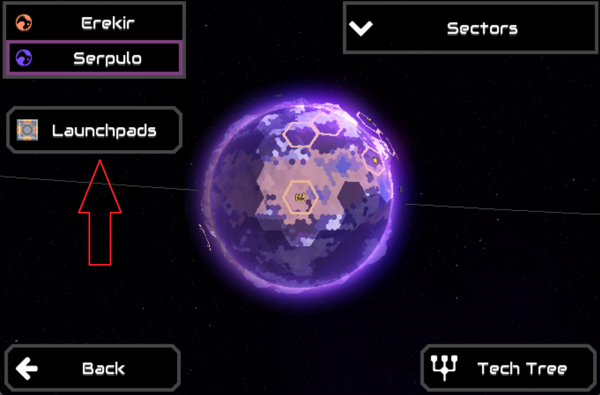
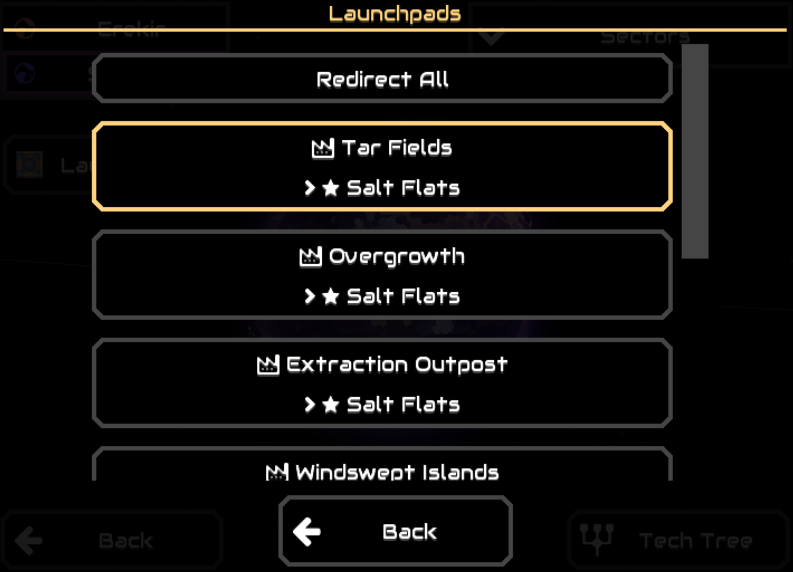
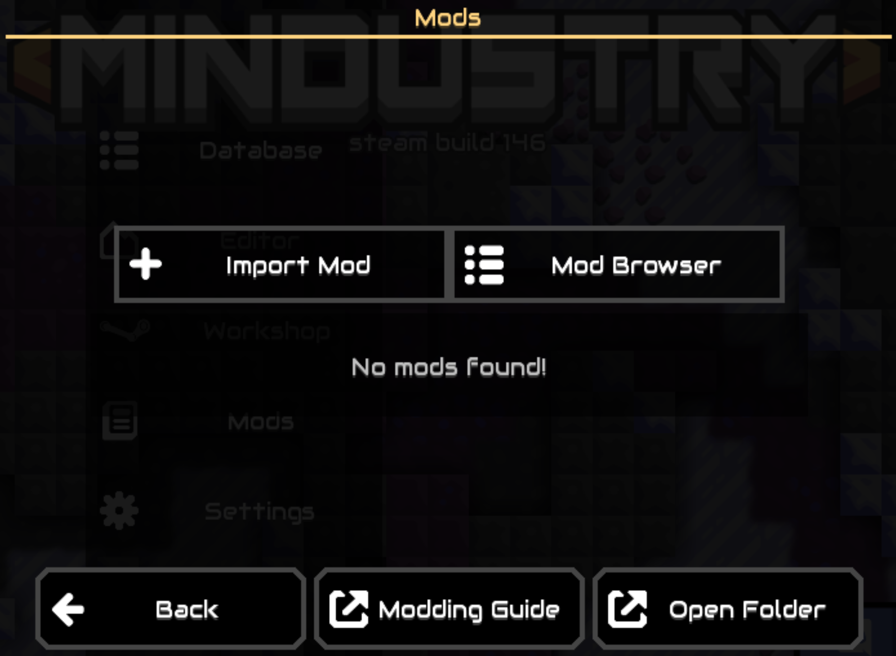
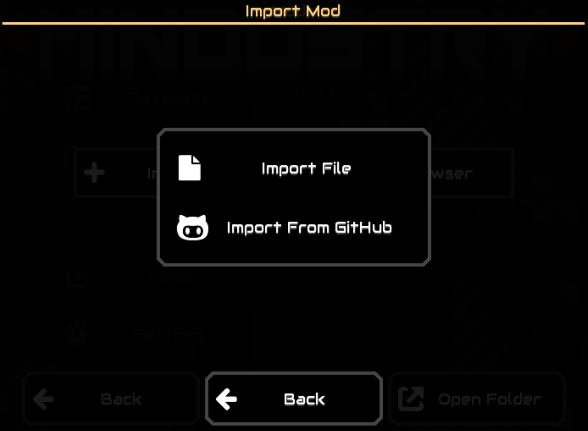
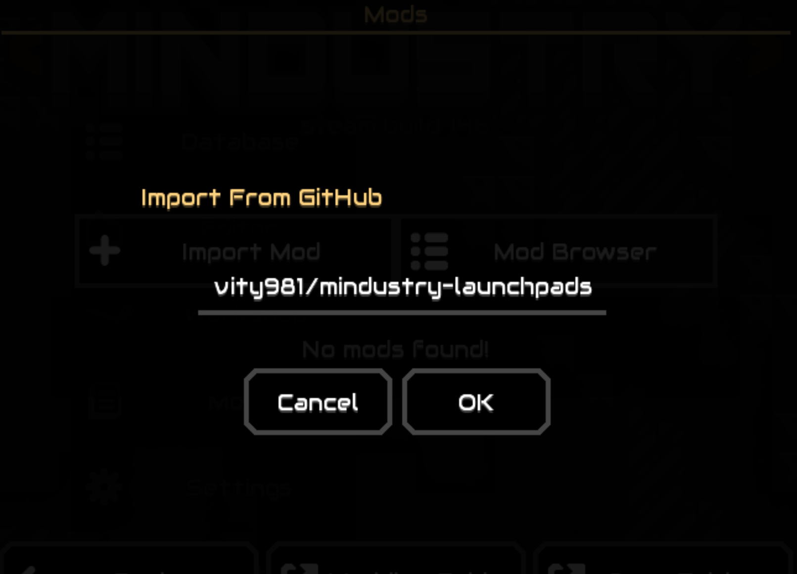

# Serpulo Launchpad Redirector

This is a fork of [DivisionByZero80/mindustry-launchpads](https://github.com/DivisionByZero80/mindustry-launchpads) which is updated to work with `MinGameVersion >= 136`

## Features

- open list of exporting sectors from planet view
- redirect single launchpad from list
- redirect all sectors at once

 

## Install
1. From the main menu go to **Mods**
1. Either import the mod from github or search for it in the mod browser 
1. Import from github 
1. Make sure to enter the correct repository name **gravity981/mindustry-launchpads** 

## Contribute
Checkout [Mindustry Wiki](https://mindustrygame.github.io/wiki/modding/1-modding/) to see how to develop mods.
